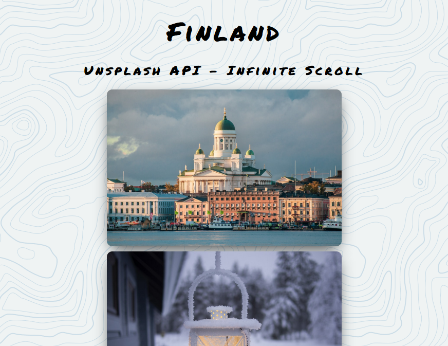

# Infinity-Scroll
New images are loaded when you reach to the bottom to create an infinite scroll effect.
- Using fetch and the Unsplash api
- Built with HTML5, CSS3 and Javascript
- Images are obtained from [unsplash.com](https://unsplash.com/) and filtered to Finland
- You can find the options for loader from [here](https://loading.io/)

## Live Project
[Click here](https://cerenpaja.github.io/Infinity-Scroll) to see beautiful photos of Finland.

## Screenshot

